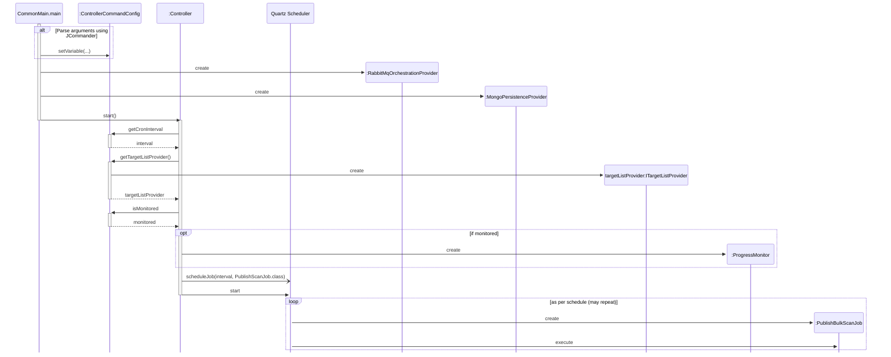
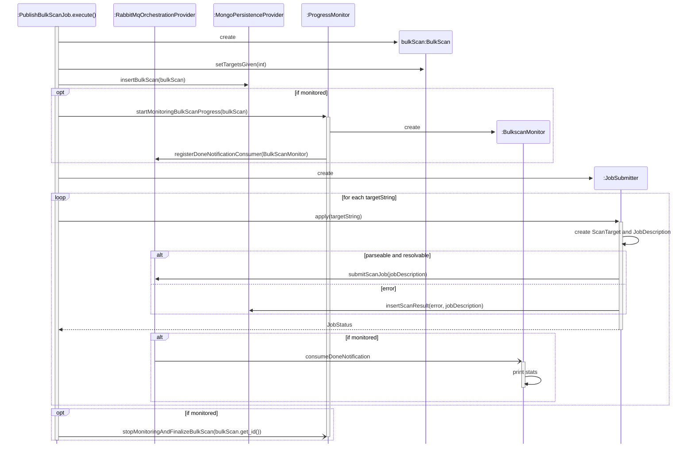
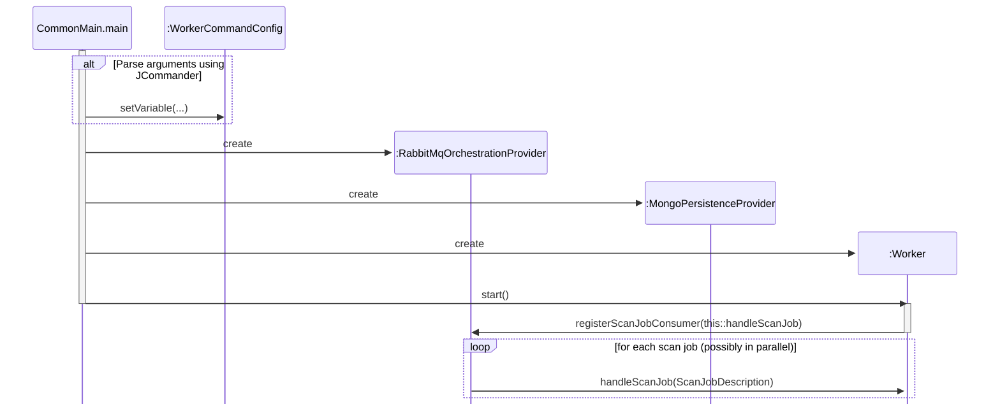
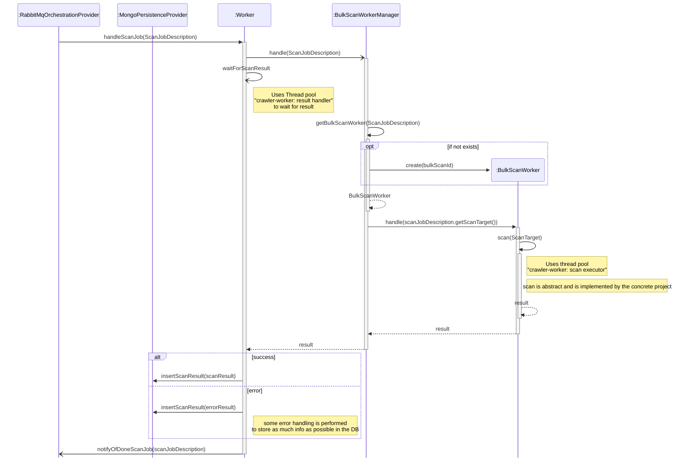

# Crawler Core

## Inner workings

### Controller

The following sequence diagrams show how the controller is started from `CommonMain.main`.
To aid readability, we split the inner workings of the Controller into two diagrams. The first one depicts how `PublishBulkScanJob` is triggered, which includes the scheduling feature.
The second diagram shows how `PublishBulkScanJob` then publishes the bulk scan.

### Worker

The following sequence diagrams show how the worker is started from `CommonMain.main`.
To aid readability, we split the inner workings of the Worker into two diagrams. The first one depicts how the `Worker` is triggered for each job.
The second diagram shows how each job is handled internally.

